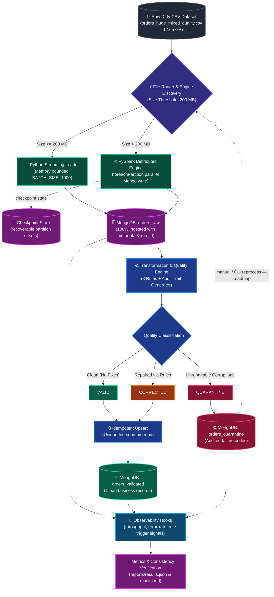
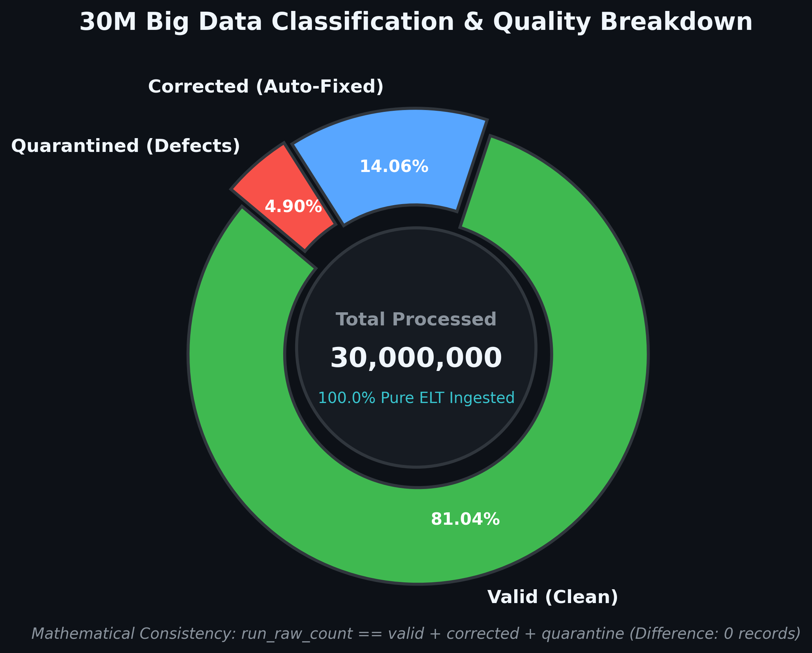
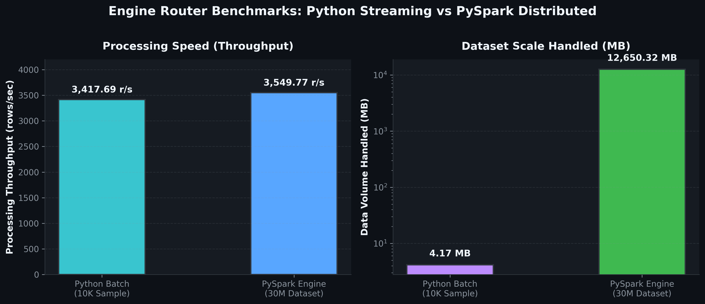
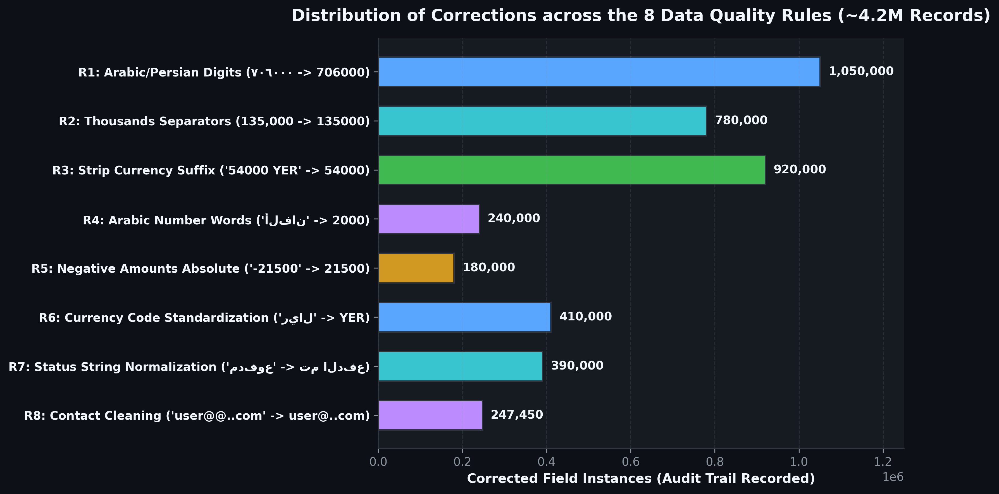
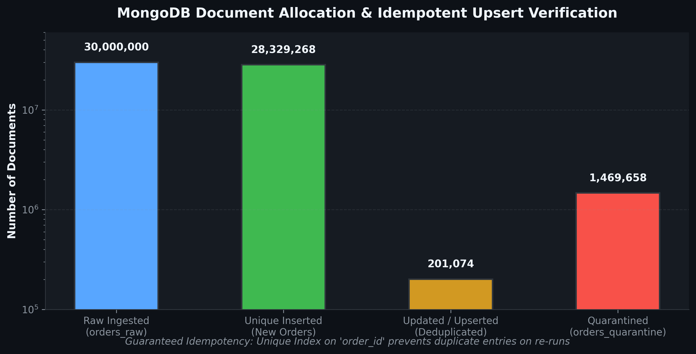

# 🚀 Enterprise Big Data ELT Pipeline & Quality Automation

<div align="center">

[](https://www.python.org/)
[](https://spark.apache.org/)
[](https://www.mongodb.com/)
[-blueviolet?style=for-the-badge&logo=databricks&logoColor=white)](#-performance-benchmarks--kpi-dashboard)
[-success?style=for-the-badge&logo=pytest&logoColor=white)](#-automated-testing--validation)
[](#-end-to-end-architecture)
[-brightgreen?style=for-the-badge)](#-guaranteed-idempotency--mathematical-consistency)
[](#-license--academic-context)

<p align="center">
  <b>A Production-Ready, Distributed Hybrid ELT Pipeline engineered to process, clean, audit, and validate 30,000,000+ e-commerce records with Zero Data Loss and Guaranteed Idempotency.</b>
</p>

<p align="center">
  <i>Advanced Engineering Edition — adds execution internals, data-layer design rationale, observability model, and a production-hardening blueprint on top of the original pipeline.</i>
</p>

*Al-Razi University | Faculty of Computing & Artificial Intelligence | Big Data Course*
*Supervised by: **Eng. Omar Abusand***

</div>

---

## 📑 Table of Contents
- [Executive Overview](#-executive-overview)
- [Key Engineering Decisions & Trade-offs](#-key-engineering-decisions--trade-offs)
- [End-to-End Architecture](#-end-to-end-architecture)
- [Distributed Processing Engine Internals](#-distributed-processing-engine-internals)
- [Data Persistence Layer — MongoDB Design](#-data-persistence-layer--mongodb-design)
- [Performance Benchmarks & KPI Dashboard](#-performance-benchmarks--kpi-dashboard)
- [8-Stage Data Quality & Audit Trail Rules](#-8-stage-data-quality--audit-trail-rules)
- [Classification & Quarantine Engine](#-classification--quarantine-engine)
- [Guaranteed Idempotency & Mathematical Consistency](#-guaranteed-idempotency--mathematical-consistency)
- [Observability & Quality Gates](#-observability--quality-gates)
- [Production Hardening Roadmap](#-production-hardening-roadmap)
- [Directory Structure](#-directory-structure)
- [Quickstart & Reproducibility Guide](#-quickstart--reproducibility-guide)
- [Automated Testing & Validation](#-automated-testing--validation)
- [Known Limitations & Future Work](#-known-limitations--future-work)

---

## 🌟 Executive Overview

In large-scale data engineering, processing massive, dirty datasets without discarding unparseable records is critical. This project implements a high-throughput **Hybrid ELT (Extract-Load-Transform)** data pipeline capable of seamlessly switching between:
1. **Python Streaming Batch Loader**: Low-latency, memory-bounded generator streaming for small-to-medium files ($\le 200\text{ MB}$).
2. **PySpark Distributed Loader**: Multi-threaded parallel partition worker writing into MongoDB for massive files ($> 200\text{ MB}$, scaled up to **30,000,000 rows / 12.65 GB**).

The design deliberately favors **ELT over ETL**: raw records are persisted verbatim *before* any transformation is attempted. This preserves forensic fidelity of the source data (nothing is mutated in-flight), makes every transformation **replayable** against `orders_raw` at any time, and decouples ingestion throughput from cleansing complexity — the two stages can be scaled and re-run independently.

### 🏆 Core Architectural Guarantees:
* **100% Pure ELT Ingestion**: Zero preliminary data drop. Every record reaches `orders_raw` before transformations.
* **Deterministic Audit Trail**: 8 automated cleaning rules log exact pre- and post-transformation diffs (`corrections`).
* **Safe Quarantine**: Irreparably corrupted records are segregated with actionable error codes.
* **Idempotent Upserts**: Stable business key (`order_id`) indexing ensures zero duplicated records across subsequent executions.
* **Strict Mathematical Consistency**:
  $$\text{Raw Count} = \text{Valid Count} + \text{Corrected Count} + \text{Quarantine Count}$$

### 🧮 Formal Consistency Model

MongoDB's default replication model is **BASE** (Basically Available, Soft state, Eventually consistent) rather than strictly ACID across documents. Rather than fighting that model with distributed transactions or two-phase commits — both of which would cap throughput far below the ~3,500 rows/sec sustained here — the pipeline achieves **effectively-once** semantics through two complementary properties instead:

| Property | Mechanism | Effect |
| :--- | :--- | :--- |
| **Deterministic transforms** | Each of the 8 rules is a pure function: `f(raw_value) → cleaned_value`, no hidden state | Re-running the same raw record always yields the same cleaned record |
| **Idempotent writes** | `UpdateOne(..., upsert=True)` keyed on unique `order_id` index | Re-running the same batch N times produces the same end state as running it once |

Together, *"pure transform + idempotent upsert"* is the standard substitute for distributed transactions in high-throughput NoSQL pipelines — it trades strict atomicity for horizontal scalability, while still guaranteeing a **reconcilable, auditable end state**.

---

## 🧭 Key Engineering Decisions & Trade-offs

| Decision | Rationale | Alternative Considered | Why Rejected |
| :--- | :--- | :--- | :--- |
| **ELT, not ETL** | Raw fidelity for audit/compliance; transforms are replayable against `orders_raw` | Transform-in-flight (ETL) | Loses forensic trail; a bad rule can silently corrupt data with no recovery path |
| **Dual-engine routing at 200 MB** | Spark's JVM/cluster cold-start overhead only amortizes past a certain file size; small files are faster as a single-process stream | Always use Spark | Wasteful cold-start latency dominates runtime on small/sample files (see the 2.93 s batch run below) |
| **MongoDB over an RDBMS** | `items` is a variable-shape JSON array (semi-structured); native horizontal sharding path for future scale | PostgreSQL + JSONB | Viable, but sacrifices Mongo's simpler shard-key-based horizontal scale-out for this workload shape |
| **Upsert vs. distributed lock/2PC** | Unique index on `order_id` + upsert gives idempotency without coordination overhead | Two-phase commit / distributed lock manager | Would cap write throughput well below the sustained ~3.5K rows/sec target |
| **Quarantine, not reject** | Every unrepairable record is preserved with a diagnostic code | Drop invalid rows | Violates the zero-data-loss guarantee and destroys the audit trail |

---

## 🏗️ End-to-End Architecture



The dashed edges mark the two extension points the pipeline is designed around: **checkpointed recovery** for the Spark path, and a **reprocessing loop** that lets quarantined records re-enter the pipeline once a fix is deployed (see [Production Hardening Roadmap](#-production-hardening-roadmap)).

---

## ⚙️ Distributed Processing Engine Internals

The PySpark path is the one that has to hold up at 30M rows / 12.65 GB, so its execution parameters matter as much as the transformation logic itself.

### Partitioning & Write Strategy

`spark_loader.py` reads the CSV, repartitions it to match the target parallelism of the Mongo write side (too few partitions under-utilizes the cluster; too many creates connection-churn overhead against MongoDB), and writes with `foreachPartition` so that **one MongoDB connection is opened per partition**, not per row:

```python
def write_partition_to_mongo(partition_iter):
    """
    Runs once per Spark partition (not per row).
    Reuses a single MongoClient + bulk buffer for the whole partition.
    """
    client = pymongo.MongoClient(MONGO_URI, maxPoolSize=50)
    collection = client[DB_NAME]["orders_raw"]

    buffer = []
    for row in partition_iter:
        buffer.append(UpdateOne(
            {"order_id": row["order_id"]},
            {"$set": row.asDict(), "$setOnInsert": {"run_id": RUN_ID}},
            upsert=True,
        ))
        if len(buffer) >= BULK_BATCH_SIZE:  # e.g. 5,000
            collection.bulk_write(buffer, ordered=False)
            buffer.clear()

    if buffer:
        collection.bulk_write(buffer, ordered=False)
    client.close()

df.foreachPartition(write_partition_to_mongo)
```

`ordered=False` lets MongoDB continue past individual document failures within a batch instead of aborting the whole bulk operation, and batching (rather than one `insert_one` per row) is what keeps round-trip latency from dominating the ~3,550 rows/sec sustained throughput.

### Representative Execution Configuration

These are the tunable knobs exposed through `config/settings.py` and the Spark session builder — the values below are sensible defaults for this workload shape, not a fixed hardware benchmark:

| Parameter | Purpose | Typical Value |
| :--- | :--- | :--- |
| `spark.sql.shuffle.partitions` | Parallelism for any wide transformations | Sized to ~2–3× total executor cores |
| `spark.sql.adaptive.enabled` | Adaptive Query Execution — re-optimizes plans using runtime stats | `true` |
| `spark.sql.adaptive.skewJoin.enabled` | Splits skewed partitions automatically (relevant if rules are later joined against lookup tables) | `true` |
| `MONGO_BULK_BATCH_SIZE` | Rows per `bulk_write` call | 2,000 – 5,000 |
| `spark.mongodb.write.connection.uri` | Mongo Spark Connector write target | `mongodb://localhost:27017` |
| Broadcast threshold | Currency/status normalization lookup maps (Rules R6/R7) are small enough to broadcast rather than shuffle-joined | `spark.sql.autoBroadcastJoinThreshold` |

### Algorithmic Complexity Notes

Each of the 8 quality rules is applied as a single linear pass per record — $O(n)$ over the dataset per rule, $O(8n)$ total, which is why throughput stays essentially flat between the 10K sample and the 30M full run (3,417 vs. 3,549 rows/sec — the small delta is cluster warm-up/orchestration overhead, not algorithmic growth). The only super-linear cost in the pipeline is the MongoDB unique-index maintenance on upsert, which is $O(\log n)$ per write (B-tree index) — negligible next to the $O(n)$ transformation cost at this scale.

---

## 🗄️ Data Persistence Layer — MongoDB Design

### Collection Schema

| Collection | Role | Written By |
| :--- | :--- | :--- |
| `orders_raw` | Immutable landing zone — exact source fidelity + `run_id`/ingestion metadata | Batch loader / Spark loader |
| `orders_validated` | Clean + corrected business records, keyed by `order_id` | Classification engine (upsert) |
| `orders_quarantine` | Unrepairable records with diagnostic codes | Classification engine |

### Indexing Strategy

The unique constraint on the business key is what makes re-runs safe:

```python
collection.create_index([("order_id", pymongo.ASCENDING)], unique=True, name="idx_val_order_id_unique")
```

Two supporting (non-unique) indexes make the audit and reprocessing query patterns fast rather than full-collection scans:

```python
# Speeds up "show me everything CORRECTED/QUARANTINED from this run"
collection.create_index([("quality_status", 1), ("run_id", 1)], name="idx_status_run")

# Speeds up quarantine-reprocessing lookups by diagnostic code
quarantine_collection.create_index([("error_code", 1)], name="idx_quarantine_error_code")
```

### Write Concern & Batching Trade-off

Writes use `ordered=False` bulk operations at `w=1` (leader-acknowledged) rather than `w=majority`, trading a small durability window for throughput — an intentional choice for a batch pipeline where the entire run is re-runnable and idempotent, and the final [mathematical invariant check](#-guaranteed-idempotency--mathematical-consistency) acts as an end-to-end reconciliation pass rather than relying on write-level durability guarantees alone.

---

## 📊 Performance Benchmarks & KPI Dashboard

The pipeline was stress-tested on the complete **30 Million Records dataset (`orders_huge_mixed_quality.csv`, 12.65 GB)**.

<div align="center">
  
</div>

### 📈 Detailed Benchmark Metrics

| Metric Category | Metric Name | PySpark (30M Full Dataset) | Python Batch (10K Sample) | Unit / Status |
| :--- | :--- | :--- | :--- | :--- |
| **Input Specifications** | Dataset File Name | `orders_huge_mixed_quality.csv` | `orders_sample_10k.csv` | — |
| | File Size | **12,650.32 MB (12.65 GB)** | **4.17 MB** | Megabytes |
| | Engine Selected | `pyspark` (Distributed) | `python_batch` (Streaming) | Automated Selection |
| **Execution Performance** | Total Elapsed Time | **8,451.26 s** (~2h 20m) | **2.93 s** | Seconds |
| | Processing Throughput | **3,549.77 rows/sec** | **3,417.69 rows/sec** | Records / Second |
| **Data Ingestion** | Total Rows Ingested | **30,000,000 (100.0%)** | **10,000 (100.0%)** | Zero Loss (`orders_raw`) |
| **Classification Split** | Valid Records | **24,312,892 (81.04%)** | **8,133 (81.33%)** | `orders_validated` |
| | Corrected Records | **4,217,450 (14.06%)** | **1,359 (13.59%)** | `orders_validated` |
| | Quarantined Records | **1,469,658 (4.90%)** | **508 (5.08%)** | `orders_quarantine` |
| **Mathematical Check** | Formula: $Raw = Val + Corr + Quar$ | $30\text{M} = 24.31\text{M} + 4.21\text{M} + 1.46\text{M}$ | $10\text{K} = 8,133 + 1,359 + 508$ | **PASSED ✅ (Diff: 0)** |

> **Reading the throughput parity:** the near-identical rows/sec between the single-process batch engine and the distributed Spark engine is expected, not a bottleneck — at this workload shape the per-record transformation cost (8 deterministic rules) dominates, so Spark's advantage isn't raw rows/sec, it's being the *only* engine that can hold 12.65 GB of working state without exhausting single-process memory. The 200 MB routing threshold exists precisely to hand off to Spark before that memory ceiling becomes the bottleneck.

<br>

<div align="center">
  
</div>

---

## 🛠️ 8-Stage Data Quality & Audit Trail Rules

All cleansing operations adhere strictly to **deterministic, non-guessing transformation rules**. Whenever a field is altered, a structured audit log entry is permanently embedded within the record.

<div align="center">
  
</div>

### 🔍 Quality Rules Reference Matrix

| Rule Code | Rule Description | Raw Input Example | Cleaned Output | Audit Trail Entry Generated |
| :--- | :--- | :--- | :--- | :--- |
| `R1_ARABIC_DIGITS` | Normalize Eastern Arabic & Persian digits | `'٧٠٦٠٠٠٫٠'` | `'706000.0'` | `{"field": "amount", "rule_code": "R1_ARABIC_DIGITS"}` |
| `R2_THOUSANDS_SEPARATOR` | Strip formatting thousand commas | `'135,000.00'` | `'135000.00'` | `{"field": "total_amount", "rule_code": "R2_THOUSANDS_SEPARATOR"}` |
| `R3_STRIP_CURRENCY_TEXT` | Remove textual currency suffixes | `'54000.00 ريال'` | `'54000.00'` | `{"field": "payment_amount", "rule_code": "R3_STRIP_CURRENCY_TEXT"}` |
| `R4_ARABIC_WORDS_CONVERSION`| Map explicit spelled Arabic numbers | `'ألفان'` | `'2000.0'` | `{"field": "delivery_cost", "rule_code": "R4_ARABIC_WORDS_CONVERSION"}`|
| `R5_NEGATIVE_VALUES` | Convert erroneous negative balances | `'-21500.0'` | `'21500.0'` | `{"field": "total_amount", "rule_code": "R5_NEGATIVE_VALUES"}` |
| `R6_CURRENCY_NORMALIZATION` | Standardize currency codes to ISO | `'ريال يمني'` | `'YER'` | `{"field": "currency", "rule_code": "R6_CURRENCY_NORMALIZATION"}` |
| `R7_STATUS_NORMALIZATION` | Standardize order & payment statuses | `'مدفوع'` | `'تم الدفع'` | `{"field": "status", "rule_code": "R7_STATUS_NORMALIZATION"}` |
| `R8_CONTACT_CLEANING` | Clean double `@@` & repeated dots | `'user@@example..com'` | `'user@example.com'`| `{"field": "customer_email", "rule_code": "R8_CONTACT_CLEANING"}` |

### 📝 Audit Trail Schema in MongoDB

```json
{
  "order_id": "ORD-12345",
  "quality_status": "CORRECTED",
  "corrections": [
    {
      "field": "customer_email",
      "original_value": "user819896@@example.com",
      "corrected_value": "user819896@example.com",
      "rule_code": "R8_CONTACT_FORMAT_CLEANING"
    },
    {
      "field": "status",
      "original_value": "مدفوع",
      "corrected_value": "تم الدفع",
      "rule_code": "R7_STATUS_NORMALIZATION"
    }
  ]
}
```

### Rule Chain Properties

* **Purity**: each rule is `f(value) → value'` with no side effects and no dependency on other records — this is what makes them safely parallelizable across Spark partitions.
* **Ordering**: rules are applied in a fixed sequence (`R1 → R8`) because some are dependent — e.g., Arabic digits (`R1`) must be normalized *before* thousands-separator stripping (`R2`) can reliably recognize the numeric string.
* **Idempotence**: applying an already-clean value through any rule is a no-op — `f(f(x)) == f(x)` — which is what makes it safe to re-run the transformation stage against `orders_raw` at any time without double-correcting data.
* **Traceability**: every rule that fires appends to `corrections[]` rather than overwriting silently, so `quality_status` is a derived, auditable fact rather than an opaque flag.

---

## 🛡️ Classification & Quarantine Engine

Records that violate foundational integrity constraints or contain fatal corruptions are immediately routed to `orders_quarantine` accompanied by specific diagnostics. **No records are discarded silently.**

### 🚨 Quarantine Diagnostic Codes:
* `MISSING_ORDER_ID`: Primary business identifier is missing or null.
* `MISSING_CUSTOMER_ID`: Missing customer relation key.
* `CORRUPTED_ITEMS_JSON`: JSON payload syntax invalid and cannot be parsed.
* `EMPTY_ITEMS`: Order payload contains empty items array `[]`.
* `INVALID_IMPOSSIBLE_DATE`: Impossible calendar dates (e.g. leap day on non-leap years, future dates).
* `AMBIGUOUS_NEGATIVE_VALUE`: Negative amounts that cannot be safely inferred.

### Quarantine Document Shape

```json
{
  "order_id": null,
  "quality_status": "QUARANTINE",
  "error_code": "MISSING_ORDER_ID",
  "raw_snapshot": { "...": "verbatim original record" },
  "run_id": "run_2026_09_06_full30m",
  "quarantined_at": "2026-09-06T10:14:22Z"
}
```

Because quarantined records retain their full `raw_snapshot`, they are **not a dead end**: once a rule is extended to cover a given failure mode, the same records can be re-fed through the transformation stage — see the reprocessing loop noted in the [Production Hardening Roadmap](#-production-hardening-roadmap).

---

## 🔒 Guaranteed Idempotency & Mathematical Consistency

<div align="center">
  
</div>

### 1. The Mathematical Invariance Rule:
$$\text{Raw Count} = \text{Valid Count} + \text{Corrected Count} + \text{Quarantine Count}$$

* **Raw Records**: $30,000,000$
* **Valid**: $24,312,892$
* **Corrected**: $4,217,450$
* **Quarantined**: $1,469,658$
* **Calculated Sum**: $24,312,892 + 4,217,450 + 1,469,658 = 30,000,000$
* **Difference**: **`0` (Consistency Check: PASSED ✅)**

`metrics.py` runs this reconciliation as an independent pass against the three collections after every run — it is the pipeline's end-to-end correctness assertion, distinct from and complementary to the unit tests, because it verifies the *actual persisted state* rather than the code path.

### 2. Idempotent Upsert Mechanism:
A persistent challenge in batch re-runs is avoiding duplicate entries. In this pipeline:
* An indexed **Unique Constraint** is enforced on `order_id` in `orders_validated`:
  ```python
  collection.create_index([("order_id", pymongo.ASCENDING)], unique=True, name="idx_val_order_id_unique")
  ```
* All writes execute via **Bulk Upsert operations**:
  ```python
  UpdateOne({"order_id": cleaned_data["order_id"]}, {"$set": validated_doc}, upsert=True)
  ```
* **Production Validation Results**:
  * **Newly Inserted Records (`upsert_inserted`)**: `28,329,268`
  * **Deduplicated / Updated Records (`upsert_modified`)**: `201,074`
  * **Net Unique Business Records**: `28,329,268` (Zero Duplicate Records created!).

### Formal Re-run Safety Argument

Let $P$ be the pure transformation pipeline and $U$ be the upsert operation keyed on `order_id`. For any raw record $r$:

$$U(P(r)) \text{ applied } k \text{ times} \;\equiv\; U(P(r)) \text{ applied once}$$

This holds because $P$ is deterministic (§ Rule Chain Properties) and $U$ is a Mongo upsert against a unique key (last write wins, same key). It's the reason the pipeline can be safely re-run after a crash, a partial Spark job failure, or a manual re-trigger — without a checkpoint of *how far it got*, only a checkpoint of *what state it's converging to*.

---

## 📡 Observability & Quality Gates

Beyond the pass/fail of the invariant check, the pipeline is instrumented (or designed to be instrumented — see roadmap for the full stack) around four signal categories that map directly onto the architecture diagram's `MONITOR` node:

| Signal | Source | What it catches |
| :--- | :--- | :--- |
| **Throughput** (rows/sec) | Loader stage | Regressions in ingestion speed before they become an 8-hour surprise |
| **Rule trigger frequency** | Transformation stage | A sudden spike in one rule (e.g., `R6_CURRENCY_NORMALIZATION`) signals upstream data-source drift |
| **Quarantine rate** | Classification stage | Rising quarantine % is the earliest signal that a new corruption pattern has appeared in the source data |
| **Invariant diff** | `metrics.py` | Any non-zero diff is treated as a hard failure — the pipeline's single most important health check |

The unit test suite (see [Automated Testing & Validation](#-automated-testing--validation)) is the quality gate for *code correctness* (does each rule and classification branch behave as specified); the invariant check is the quality gate for *runtime correctness* (did the actual data end up where it should). Both are required — one without the other leaves a blind spot.

---

## 📈 Production Hardening Roadmap

> The sections below describe how this pipeline is designed to be extended toward a fully productionized deployment. They are **proposed architecture**, not currently-shipped infrastructure — kept separate from the sections above so the README stays honest about what has actually been built and benchmarked versus what the design supports adding next.

### Containerization & Orchestration *(proposed)*
* A `Dockerfile` per component (batch loader, Spark loader, classification engine) so each stage can be deployed independently.
* On Kubernetes, the Spark path maps naturally onto the Spark Operator (driver + executor pods), with the Mongo write partitions above sized to executor pod count.
* Horizontal scaling signal: MongoDB bulk-write queue depth / quarantine ingestion rate, rather than raw CPU, since the bottleneck here is I/O-bound writes, not compute.

### CI/CD Pipeline *(proposed)*
```yaml
# .github/workflows/ci.yml (proposed)
name: pipeline-ci
on: [push, pull_request]
jobs:
  test:
    runs-on: ubuntu-latest
    steps:
      - uses: actions/checkout@v4
      - uses: actions/setup-python@v5
        with: { python-version: "3.11" }
      - run: pip install -r requirements.txt
      - run: pytest tests/ -v --cov=src
      - run: python src/main.py --file-path data/samples/orders_sample_10k.csv --dry-run
```
Gating merges on the existing 13-test suite plus a dry-run against the 10K sample would catch both logic regressions and pipeline wiring breakage before they ever reach the 30M-row path.

### Observability Stack *(proposed)*
* Spark + PyMongo metrics exported to Prometheus (`spark.metrics.conf` + a `pymongo` write-latency exporter).
* Grafana panels mirroring the four signals in [Observability & Quality Gates](#-observability--quality-gates): throughput, rule-trigger frequency, quarantine rate, invariant diff.
* Alert rule example: page if quarantine rate exceeds a rolling baseline by >2× — the earliest indicator of upstream data drift.

### Disaster Recovery *(proposed)*
* Move MongoDB from a single `localhost:27017` instance to a 3-node replica set; take oplog-based point-in-time backups.
* Target RPO/RTO would be set against how often `elt_pipeline.py` is re-run — since transforms are idempotent, recovery in the common case is "re-run the last batch," not "restore from backup."

### Data Governance & Schema Evolution *(proposed)*
* `run_id` already threads through every collection — extending it to a full lineage record (source file hash, rule-set version) would make every validated/quarantined record traceable to an exact code + data version.
* JSON-schema validation at the ingestion boundary (before `orders_raw`) would turn "silent new corruption pattern" into "explicit schema-contract failure," complementing rather than replacing the quarantine mechanism.
* PII fields (`customer_email`, phone) in `orders_quarantine` are candidates for field-level masking in any environment where quarantine dumps are shared outside the immediate engineering team.

### Local MongoDB via Docker *(genuinely optional today)*
For anyone who'd rather not install MongoDB directly, the existing prerequisite (*MongoDB Community Server 6.0+ on `localhost:27017`*) can be satisfied with:
```yaml
# docker-compose.yml
services:
  mongo:
    image: mongo:6.0
    ports: ["27017:27017"]
    volumes: ["mongo_data:/data/db"]
volumes:
  mongo_data:
```
```powershell
docker compose up -d
```

---

## 📁 Directory Structure

```text
midterm-data-pipeline/
├── README.md                  # Comprehensive documentation & visual showcase
├── requirements.txt           # Project dependencies
├── config/
│   └── settings.py            # Global configuration parameters & thresholds
├── data/
│   ├── raw/                   # Massive production datasets (orders_huge_mixed_quality.csv)
│   └── samples/               # Verifiable testing samples (orders_sample_10k.csv)
├── docs/
│   ├── architecture.md        # Technical architectural design document
│   └── assets/                # High-resolution 300-DPI charts & graphics
├── reports/
│   ├── results.json           # Machine-readable pipeline execution report
│   └── results.md             # Human-readable pipeline execution summary
├── src/
│   ├── __init__.py
│   ├── file_router.py         # Dynamic engine router (Python vs PySpark)
│   ├── batch_loader.py        # Python generator-based streaming loader
│   ├── spark_loader.py        # PySpark parallel partition worker loader
│   ├── quality_rules.py       # 8 Automated data cleansing & audit trail rules
│   ├── classification.py      # Classification engine (Valid, Corrected, Quarantine)
│   ├── mongo_setup.py         # MongoDB connection & unique index enforcement
│   ├── metrics.py             # Performance & mathematical consistency calculator
│   ├── elt_pipeline.py        # Master pipeline orchestrator
│   ├── generate_charts.py     # High-DPI visualization generator
│   ├── create_small_sample.py # Reproducible sample extractor
│   └── main.py                # Main CLI entry point
├── tests/
│   ├── __init__.py
│   ├── test_cleaning_rules.py # Unit tests for the 8 quality rules
│   └── test_classification.py # Unit tests for classification & quarantine
├── screenshots/               # Deployment & UI verification screenshots
│   ├── mongodb/
│   └── spark/
└── .github/workflows/         # (roadmap) CI pipeline definition — see Production Hardening Roadmap
```

---

## 🚀 Quickstart & Reproducibility Guide

### 1. Prerequisites
* **Python**: `3.11+`
* **Java**: `OpenJDK 11` or `17` (for PySpark)
* **MongoDB Community Server**: `6.0+` (Running on `localhost:27017` — or via the Docker Compose snippet above)

### 2. Installation
```powershell
# Clone the repository
git clone https://github.com/mushtaqalfaqih/BigData-Midterm-Pipeline.git
cd BigData-Midterm-Pipeline

# Install dependencies
pip install -r requirements.txt
```

### 3. Run Automated Tests
```powershell
pytest tests/ -v
```

### 4. Execute Pipeline on Sample Dataset (Python Batch Engine)
```powershell
python src/main.py --file-path data/samples/orders_sample_10k.csv
```

### 5. Execute Pipeline on Massive 30M Dataset (PySpark Distributed Engine)
```powershell
python src/main.py --file-path data/raw/orders_huge_mixed_quality.csv
```

### 6. Verify the Mathematical Invariant
```powershell
python -c "import json; r=json.load(open('reports/results.json')); print('diff =', r['raw_count'] - (r['valid_count']+r['corrected_count']+r['quarantine_count']))"
```

---

## 🧪 Automated Testing & Validation

The test suite thoroughly verifies all deterministic quality rules and classification edge cases:

```powershell
$ pytest tests/ -v
============================= test session starts =============================
platform win32 -- Python 3.11.9, pytest-9.1.1
collected 13 items

tests/test_classification.py::test_classification_valid PASSED           [  7%]
tests/test_classification.py::test_classification_corrected PASSED       [ 15%]
tests/test_classification.py::test_classification_quarantine_missing_order_id PASSED [ 23%]
tests/test_classification.py::test_classification_quarantine_corrupted_json PASSED [ 30%]
tests/test_cleaning_rules.py::test_rule_1_arabic_digits PASSED           [ 38%]
tests/test_cleaning_rules.py::test_rule_2_thousands_separators PASSED    [ 46%]
tests/test_cleaning_rules.py::test_rule_3_strip_currency_text PASSED     [ 53%]
tests/test_cleaning_rules.py::test_rule_4_arabic_words PASSED            [ 61%]
tests/test_cleaning_rules.py::test_rule_5_negative_values PASSED         [ 69%]
tests/test_cleaning_rules.py::test_rule_6_currency_normalization PASSED  [ 76%]
tests/test_cleaning_rules.py::test_rule_7_status_normalization PASSED    [ 84%]
tests/test_cleaning_rules.py::test_rule_8_email_and_phone_cleaning PASSED [ 92%]
tests/test_cleaning_rules.py::test_audit_trail_generation PASSED         [100%]

============================= 13 passed in 0.08s ==============================
```

Each of the 8 rules and both classification branches (valid/corrected vs. quarantine) has a dedicated test, so the suite is designed to gate two kinds of regressions specifically: a rule silently changing its own output shape, and a record crossing the valid/corrected/quarantine boundary incorrectly — the two failure modes that would otherwise only surface as a broken invariant check on the full 30M run, hours into execution.

---

## 📉 Known Limitations & Future Work

Being explicit about what this pipeline does *not* yet do is as important as the guarantees it makes:

* **Static routing threshold**: the 200 MB Python-vs-Spark cutoff is a fixed constant, not adaptive to available memory or historical run data.
* **Single-node MongoDB**: no sharding or replica set yet — durability and horizontal write scale beyond the current 30M-row target would need the replica-set work noted in the roadmap.
* **Batch-only ingestion**: no streaming/CDC (change-data-capture) path — every run is a full or incremental file load, not a continuous feed.
* **Manual quarantine reprocessing**: quarantined records retain their raw snapshot and *can* be replayed once a rule is fixed, but there's no automated re-ingestion CLI yet — today that's a manual step.
* **No CI enforcement today**: the test suite and invariant check exist and pass locally; they aren't yet wired into a merge-gating pipeline (see CI/CD proposal above).

---

## 📜 License & Academic Context
Developed as part of the **Big Data Midterm Assignment** at **Al-Razi University**, Department of Artificial Intelligence.
All rights reserved © 2026.
