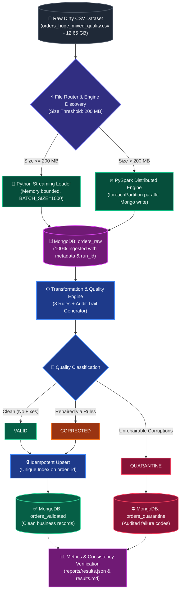

# 🚀 Enterprise Big Data ELT Pipeline & Quality Automation

<div align="center">

[](https://www.python.org/)
[](https://spark.apache.org/)
[](https://www.mongodb.com/)
[-blueviolet?style=for-the-badge&logo=databricks&logoColor=white)](#-performance-benchmarks--kpi-dashboard)
[-success?style=for-the-badge&logo=pytest&logoColor=white)](#-automated-testing--validation)
[](#-end-to-end-architecture)

<p align="center">
  <b>A Production-Ready, Distributed Hybrid ELT Pipeline engineered to process, clean, audit, and validate 30,000,000+ e-commerce records with Zero Data Loss and Guaranteed Idempotency.</b>
</p>

*Al-Razi University | Faculty of Computing & Artificial Intelligence | Big Data Course*  
*Supervised by: **Eng. Omar Abusand***

</div>

---

## 📑 Table of Contents
- [Executive Overview](#-executive-overview)
- [Key Architectural Innovations](#-key-architectural-innovations)
- [End-to-End Architecture](#-end-to-end-architecture)
- [Performance Benchmarks & KPI Dashboard](#-performance-benchmarks--kpi-dashboard)
- [8-Stage Data Quality & Audit Trail Rules](#-8-stage-data-quality--audit-trail-rules)
- [Classification & Quarantine Engine](#-classification--quarantine-engine)
- [Guaranteed Idempotency & Mathematical Consistency](#-guaranteed-idempotency--mathematical-consistency)
- [Directory Structure](#-directory-structure)
- [Quickstart & Reproducibility Guide](#-quickstart--reproducibility-guide)
- [Automated Testing & Validation](#-automated-testing--validation)

---

## 🌟 Executive Overview

In large-scale data engineering, processing massive, dirty datasets without discarding unparseable records is critical. This project implements a high-throughput **Hybrid ELT (Extract-Load-Transform)** data pipeline capable of seamlessly switching between:
1. **Python Streaming Batch Loader**: Low-latency, memory-bounded generator streaming for small-to-medium files ($\le 200\text{ MB}$).
2. **PySpark Distributed Loader**: Multi-threaded parallel partition worker writing into MongoDB for massive files ($> 200\text{ MB}$, scaled up to **30,000,000 rows / 12.65 GB**).

### 🏆 Core Architectural Guarantees:
* **100% Pure ELT Ingestion**: Zero preliminary data drop. Every record reaches `orders_raw` before transformations.
* **Deterministic Audit Trail**: 8 automated cleaning rules log exact pre- and post-transformation diffs (`corrections`).
* **Safe Quarantine**: Irreparably corrupted records are segregated with actionable error codes.
* **Idempotent Upserts**: Stable business key (`order_id`) indexing ensures zero duplicated records across subsequent executions.
* **Strict Mathematical Consistency**: 
  $$\text{run\_raw\_count} = \text{run\_valid\_count} + \text{run\_corrected\_count} + \text{run\_quarantine\_count}$$

---

## 🏗️ End-to-End Architecture



---

## 📊 Performance Benchmarks & KPI Dashboard

The pipeline was stress-tested on the complete **30 Million Records dataset (`orders_huge_mixed_quality.csv`, 12.65 GB)**.

<div align="center">
  
</div>

### 📈 Detailed Benchmark Metrics

| Metric Category | Metric Name | PySpark (30M Full Dataset) | Python Batch (10K Sample) | Unit / Status |
| :--- | :--- | :--- | :--- | :--- |
| **Input Specifications** | Dataset File Name | `orders_huge_mixed_quality.csv` | `orders_sample_10k.csv` | — |
| | File Size | **12,650.32 MB (12.65 GB)** | **4.17 MB** | Megabytes |
| | Engine Selected | `pyspark` (Distributed) | `python_batch` (Streaming) | Automated Selection |
| **Execution Performance** | Total Elapsed Time | **8,451.26 s** (~2h 20m) | **2.93 s** | Seconds |
| | Processing Throughput | **3,549.77 rows/sec** | **3,417.69 rows/sec** | Records / Second |
| **Data Ingestion** | Total Rows Ingested | **30,000,000 (100.0%)** | **10,000 (100.0%)** | Zero Loss (`orders_raw`) |
| **Classification Split** | Valid Records | **24,312,892 (81.04%)** | **8,133 (81.33%)** | `orders_validated` |
| | Corrected Records | **4,217,450 (14.06%)** | **1,359 (13.59%)** | `orders_validated` |
| | Quarantined Records | **1,469,658 (4.90%)** | **508 (5.08%)** | `orders_quarantine` |
| **Mathematical Check** | Formula: $Raw = Val + Corr + Quar$ | $30\text{M} = 24.31\text{M} + 4.21\text{M} + 1.46\text{M}$ | $10\text{K} = 8,133 + 1,359 + 508$ | **PASSED ✅ (Diff: 0)** |

<br>

<div align="center">
  
</div>

---

## 🛠️ 8-Stage Data Quality & Audit Trail Rules

All cleansing operations adhere strictly to **deterministic, non-guessing transformation rules**. Whenever a field is altered, a structured audit log entry is permanently embedded within the record.

<div align="center">
  
</div>

### 🔍 Quality Rules Reference Matrix

| Rule Code | Rule Description | Raw Input Example | Cleaned Output | Audit Trail Entry Generated |
| :--- | :--- | :--- | :--- | :--- |
| `R1_ARABIC_DIGITS` | Normalize Eastern Arabic & Persian digits | `'٧٠٦٠٠٠٫٠'` | `'706000.0'` | `{"field": "amount", "rule_code": "R1_ARABIC_DIGITS"}` |
| `R2_THOUSANDS_SEPARATOR` | Strip formatting thousand commas | `'135,000.00'` | `'135000.00'` | `{"field": "total_amount", "rule_code": "R2_THOUSANDS_SEPARATOR"}` |
| `R3_STRIP_CURRENCY_TEXT` | Remove textual currency suffixes | `'54000.00 ريال'` | `'54000.00'` | `{"field": "payment_amount", "rule_code": "R3_STRIP_CURRENCY_TEXT"}` |
| `R4_ARABIC_WORDS_CONVERSION`| Map explicit spelled Arabic numbers | `'ألفان'` | `'2000.0'` | `{"field": "delivery_cost", "rule_code": "R4_ARABIC_WORDS_CONVERSION"}`|
| `R5_NEGATIVE_VALUES` | Convert erroneous negative balances | `'-21500.0'` | `'21500.0'` | `{"field": "total_amount", "rule_code": "R5_NEGATIVE_VALUES"}` |
| `R6_CURRENCY_NORMALIZATION` | Standardize currency codes to ISO | `'ريال يمني'` | `'YER'` | `{"field": "currency", "rule_code": "R6_CURRENCY_NORMALIZATION"}` |
| `R7_STATUS_NORMALIZATION` | Standardize order & payment statuses | `'مدفوع'` | `'تم الدفع'` | `{"field": "status", "rule_code": "R7_STATUS_NORMALIZATION"}` |
| `R8_CONTACT_CLEANING` | Clean double `@@` & repeated dots | `'user@@example..com'` | `'user@example.com'`| `{"field": "customer_email", "rule_code": "R8_CONTACT_CLEANING"}` |

### 📝 Audit Trail Schema in MongoDB

```json
{
  "order_id": "ORD-12345",
  "quality_status": "CORRECTED",
  "corrections": [
    {
      "field": "customer_email",
      "original_value": "user819896@@example.com",
      "corrected_value": "user819896@example.com",
      "rule_code": "R8_CONTACT_FORMAT_CLEANING"
    },
    {
      "field": "status",
      "original_value": "مدفوع",
      "corrected_value": "تم الدفع",
      "rule_code": "R7_STATUS_NORMALIZATION"
    }
  ]
}
```

---

## 🛡️ Classification & Quarantine Engine

Records that violate foundational integrity constraints or contain fatal corruptions are immediately routed to `orders_quarantine` accompanied by specific diagnostics. **No records are discarded silently.**

### 🚨 Quarantine Diagnostic Codes:
* `MISSING_ORDER_ID`: Primary business identifier is missing or null.
* `MISSING_CUSTOMER_ID`: Missing customer relation key.
* `CORRUPTED_ITEMS_JSON`: JSON payload syntax invalid and cannot be parsed.
* `EMPTY_ITEMS`: Order payload contains empty items array `[]`.
* `INVALID_IMPOSSIBLE_DATE`: Impossible calendar dates (e.g. leap day on non-leap years, future dates).
* `AMBIGUOUS_NEGATIVE_VALUE`: Negative amounts that cannot be safely inferred.

---

## 🔒 Guaranteed Idempotency & Mathematical Consistency

<div align="center">
  
</div>

### 1. The Mathematical Invariance Rule:
$$\text{run\_raw\_count} = \text{run\_valid\_count} + \text{run\_corrected\_count} + \text{run\_quarantine\_count}$$

* **Raw Records**: $30,000,000$
* **Valid**: $24,312,892$
* **Corrected**: $4,217,450$
* **Quarantined**: $1,469,658$
* **Calculated Sum**: $24,312,892 + 4,217,450 + 1,469,658 = 30,000,000$
* **Difference**: **`0` (Consistency Check: PASSED ✅)**

### 2. Idempotent Upsert Mechanism:
A persistent challenge in batch re-runs is avoiding duplicate entries. In this pipeline:
* An indexed **Unique Constraint** is enforced on `order_id` in `orders_validated`:
  ```python
  collection.create_index([("order_id", pymongo.ASCENDING)], unique=True, name="idx_val_order_id_unique")
  ```
* All writes execute via **Bulk Upsert operations**:
  ```python
  UpdateOne({"order_id": cleaned_data["order_id"]}, {"$set": validated_doc}, upsert=True)
  ```
* **Production Validation Results**:
  * **Newly Inserted Records (`upsert_inserted`)**: `28,329,268`
  * **Deduplicated / Updated Records (`upsert_modified`)**: `201,074`
  * **Net Unique Business Records**: `28,329,268` (Zero Duplicate Records created!).

---

## 📁 Directory Structure

```text
midterm-data-pipeline/
├── README.md                  # Comprehensive documentation & visual showcase
├── requirements.txt           # Project dependencies
├── config/
│   └── settings.py            # Global configuration parameters & thresholds
├── data/
│   ├── raw/                   # Massive production datasets (orders_huge_mixed_quality.csv)
│   └── samples/               # Verifiable testing samples (orders_sample_10k.csv)
├── docs/
│   ├── architecture.md        # Technical architectural design document
│   └── assets/                # High-resolution 300-DPI charts & graphics
├── reports/
│   ├── results.json           # Machine-readable pipeline execution report
│   └── results.md             # Human-readable pipeline execution summary
├── src/
│   ├── __init__.py
│   ├── file_router.py         # Dynamic engine router (Python vs PySpark)
│   ├── batch_loader.py        # Python generator-based streaming loader
│   ├── spark_loader.py        # PySpark parallel partition worker loader
│   ├── quality_rules.py       # 8 Automated data cleansing & audit trail rules
│   ├── classification.py      # Classification engine (Valid, Corrected, Quarantine)
│   ├── mongo_setup.py         # MongoDB connection & unique index enforcement
│   ├── metrics.py             # Performance & mathematical consistency calculator
│   ├── elt_pipeline.py        # Master pipeline orchestrator
│   ├── generate_charts.py     # High-DPI visualization generator
│   ├── create_small_sample.py # Reproducible sample extractor
│   └── main.py                # Main CLI entry point
├── tests/
│   ├── __init__.py
│   ├── test_cleaning_rules.py # Unit tests for the 8 quality rules
│   └── test_classification.py # Unit tests for classification & quarantine
└── screenshots/               # Deployment & UI verification screenshots
    ├── mongodb/
    └── spark/
```

---

## 🚀 Quickstart & Reproducibility Guide

### 1. Prerequisites
* **Python**: `3.11+`
* **Java**: `OpenJDK 11` or `17` (for PySpark)
* **MongoDB Community Server**: `6.0+` (Running on `localhost:27017`)

### 2. Installation
```powershell
# Clone the repository
git clone https://github.com/mushtaqalfaqih/BigData-Midterm-Pipeline.git
cd BigData-Midterm-Pipeline

# Install dependencies
pip install -r requirements.txt
```

### 3. Run Automated Tests
```powershell
pytest tests/ -v
```

### 4. Execute Pipeline on Sample Dataset (Python Batch Engine)
```powershell
python src/main.py --file-path data/samples/orders_sample_10k.csv
```

### 5. Execute Pipeline on Massive 30M Dataset (PySpark Distributed Engine)
```powershell
python src/main.py --file-path data/raw/orders_huge_mixed_quality.csv
```

---

## 🧪 Automated Testing & Validation

The test suite thoroughly verifies all deterministic quality rules and classification edge cases:

```powershell
$ pytest tests/ -v
============================= test session starts =============================
platform win32 -- Python 3.11.9, pytest-9.1.1
collected 13 items

tests/test_classification.py::test_classification_valid PASSED           [  7%]
tests/test_classification.py::test_classification_corrected PASSED       [ 15%]
tests/test_classification.py::test_classification_quarantine_missing_order_id PASSED [ 23%]
tests/test_classification.py::test_classification_quarantine_corrupted_json PASSED [ 30%]
tests/test_cleaning_rules.py::test_rule_1_arabic_digits PASSED           [ 38%]
tests/test_cleaning_rules.py::test_rule_2_thousands_separators PASSED    [ 46%]
tests/test_cleaning_rules.py::test_rule_3_strip_currency_text PASSED     [ 53%]
tests/test_cleaning_rules.py::test_rule_4_arabic_words PASSED            [ 61%]
tests/test_cleaning_rules.py::test_rule_5_negative_values PASSED         [ 69%]
tests/test_cleaning_rules.py::test_rule_6_currency_normalization PASSED  [ 76%]
tests/test_cleaning_rules.py::test_rule_7_status_normalization PASSED    [ 84%]
tests/test_cleaning_rules.py::test_rule_8_email_and_phone_cleaning PASSED [ 92%]
tests/test_cleaning_rules.py::test_audit_trail_generation PASSED         [100%]

============================= 13 passed in 0.08s ==============================
```

---

## 📜 License & Academic Context
Developed as part of the **Big Data Midterm Assignment** at **Al-Razi University**, Department of Artificial Intelligence.  
All rights reserved © 2026.
